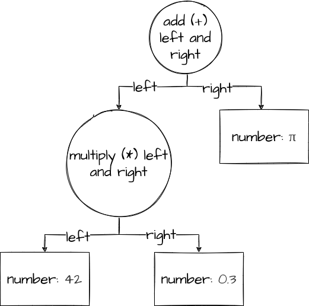
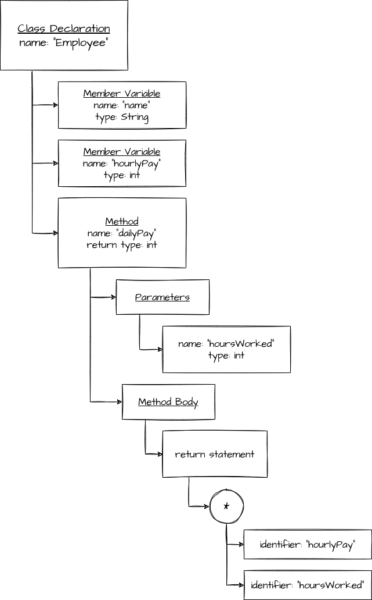

# Parsing: The Art of Understanding Text
If you just Google the definition of "parsing," you'll get this:

> analyze (a sentence) into its parts and describe their syntactic roles.
> 
> "I asked a couple of students to parse these sentences for me"

This is precisely what the first step of most compilers is. The compiler needs to *parse* a text file that a human gave it, and make sense of the code that the human wrote inside of that. 

But how does a compiler actually *do* that? 

## The Language
Consider an imaginary programming language that is written as a series of mathematical expressions and mathematical functions, and these are meant to tell the computer to evaluate some expression to a numeric value, or to graph some function. 

> We're going to ignore `xy` as shorthand for `x * y`, it makes the following explanation significantly more complicated and ends up impeding understanding. 

Let's also say that `pi` is equivalent to the $$ \pi $$ constant.

Here's some simple examples of what this imaginary language looks like: 

~~~
8 * (pi / 6) + (12 - 6) / 0.3
~~~

We as humans can look at this and understand what math it's trying to express. But, making a *compiler* understand this is significantly harder. 

## What the Computer Sees

Let's say we're making a "compiler" for math equations for some reason, and have the following source code:

~~~
42 * 0.3 + pi
~~~

When the compiler first looks at a file, it sees something very similar to this:

It doesn't have any immediate structure that it recognizes from the text file we gave it, all it sees is a really long list of characters, spaces, symbols and whatnot. 

This isn't unique to the above example either! Consider this example:

~~~
(pi / 3) - 67
~~~

No matter what we do, all the computer sees is a giant list of symbols! 

## "Lexing": Breaking Down the List
A huge list of single symbols is not exactly trivial to make sense of (although it *is* possible). Most compilers and other tools trying to make sense of a programming language start by "lexing" the list of symbols.

Lexing is jargon for "lexical analysis," which is technobabble for "breaking down a big blob of text into related chunks." The end goal of lexing is to turn a giant list of random symbols into something slightly more manageable. A smaller list of chunks is much easier to make sense of than a huge list of single characters, after all. 

Often, lexing "throws out" (ignores) characters that are irrelevant to the actual meaning of a program. Things like spaces or tabs for example are completely irrelevant to the *meaning* of the math expressions shown above, and therefore we can safely ignore them. 

Consider again our first example:

~~~
42 * 0.3 + pi
~~~

The end result of lexing would look something like this:

Even though we didn't change the content of the list very much, I'd wager this is a lot easier for you
to make sense of. The "chunks" of the math equation are now put together into single pieces, rather than
being split into multiple characters. 

In addition to simplifying this for us, we have also drastically simplified this for the computer. No longer does every other piece of code in the compiler have to know that `p` followed by `i` means `pi`, or that `0` followed by `.` followed by `3`  means `0.3`. Lexing has figured that out and now can just tell other code that there's a `0.3`. 

## "Parsing": Making Sense of the List
While lexing helped break up that giant list of symbols into a more manageable list, parsing is what actually makes sense of that list. 

The goal of parsing is to turn that list of chunks into some structure the computer can understand. This typically means generating an "AST" (Abstract Syntax Tree). 

An AST is a highly abstract and highly structured representation of the code, and much more closely follows the *meaning* of the code rather than following what the text file says. 

Here's an example, an AST for the above list of chunks:

In this case, the AST is describing what operations the language is saying to do, and *in what order*. Things like order of operations need to be accounted for, the parser is supposed to be able to figure out that `1 + 2 * 3 / 4` is `1 + ((2 * 3) / 4)` and not `(1 + 2) * (3 / 4)` or whatever. The parser also has to be able to figure out what things like `pi` mean, and map them to the correct *idea*.

To express this, the AST shows exactly how the equation should be evaluated. You start by looking at the "add." In order to add two numbers, we need to know the `left` and `right` numbers, 
so we go down a level and look. The right is just `π`, but the
left is a `*`. Since we need to know what to multiply, we go down a level again and look at the `left` and `right` of the multiply.

### Another Example
> A more abbreviated form of AST will be used from now on for space reasons. `+` still means "add the left and right," `42` still means "the number `42`", but it won't be as verbose.

Consider a much more complicated expression:

~~~
(pi + 6) / 0.352 * (12.01 - 0.776)
~~~

While this expression may be quite a bit more muddled than the previous, it still maps perfectly to a (relatively) clean AST:

## Beyond Math Expressions
> **Note: Past this point assumes some basic programming knowledge.**

While every example so far has been just math, parsing is used for *far* more than just math expressions. 

The exact same ideas can be applied to anything a programming language needs to express. 

Consider the following Java code:

~~~ cs
class Employee {
  public String name;
  public int hourlyPay;

  public int dailyPay(int hoursWorked) {
    return hourlyPay * hoursWorked;  
  }
}
~~~

This can be mapped into an AST just like the math expression examples can. 

While it's a *much* more complex AST than the ones for the simple math expressions
we were considering earlier, it still models the same idea: it's a rigid hierarchical
structure that is being used to model an entire program (or in this case, an entire class).

Real production-grade compilers usually cram a huge amount of information into their ASTs, but at
the end of the day, it's still the same fundamental concept.