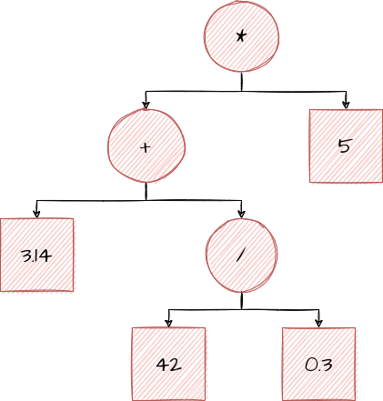

# IR: Between Source Code and Machine Code

After we've successfully verified that a program makes sense, we actually need to start doing our real job as a compiler and *translating* the AST into machine instructions. 

Recall that machine instructions are extremely low-level and pedantic, and that our AST really isn't. 
Our AST doesn't describe where we need to store temporary data, or give us a way to easily see patterns.

To simplify our job, we need a layer between the computer's language and our AST. That layer is "IR," or "Intermediary Representation." 

## A Simple IR

For the purposes of this article, let's create the following "IR":

~~~ js
name = left operation right
~~~

This means that the value `name` is the result of `operation`, when performed with `left` and `right`.

This IR could represent `1 * 2` like this:

~~~ js
result = 1 * 2
~~~

`result` here would be the result of multiplying `1` by `2`, or `2`.

What happens if we want to have more complicated operations?

We just make more operations, of course! Consider the IR for `1 + 2 * 3`:

~~~ js
a = 2 * 3
result = 1 + a // a = 6, this is just like 1 + 6
~~~

Each operation is performed in order, from top to bottom. The main idea here is that we can use the
result of *old* operations in our new ones to
build compound operations. 

With this, we represent our operations in a way that's much closer to how the computer would. 

## An Example, Revisited

Let's consider the equation `(3.14 + (42 / 0.3)) * 5`, which has the following AST:

You may recall that we type-checked this in the previous article. Now, let's try to represent it with our IR:

~~~ js
a = 42 / 0.3
b = a + 3.14 
result = b * 5   
~~~

It maps perfectly! But now, we have something that is actually fairly simple to translate to our computer's language. 

## Optimization

While having an IR makes it much easier for us to translate again into machine language, that doesn't
mean it's *impossible* to do it. So, what's the point of adding the extra layer? Why not just grit our teeth
and just write the code to translate directly?

The answer is *optimization*: with IR, we are able to look at exactly what our program is doing,
and change it slightly to make it simpler (and faster) for the computer to calculate. We can also
trivially remove useless operations, and calculate results ahead-of-time. 

The key idea here is that it's easier for your computer to do some operations than others, so we
want to figure out how to make our program do more of the fast operations and less of the slow ones. 

Let's consider the following example:

~~~ js
// x = something, doesn't matter for this example
a = x * 27
b = a / 27
result = b^2
~~~

How could this be made *better*? Well, let's start with simple mathematical optimizations.

~~~ js
a = x * 27 
b = a / 27 
~~~

We know that anything multiplied by `27` and then immediately divided by `27` again
is just the number we started with, so we can remove `x * 27` and `a / 27` operations 
entirely. We know that They don't actually do anything, and just add more for the computer to calculate. 

Let's apply our simple optimization:

~~~ js
b = x
result = b^2
~~~

Now, we can look at our IR again. We see that `b` is being raised to the power of 2. We know that
`b * b` is the same as `b^2`, so we replace it:

> *Note: the reason why we do this is that, in general, a single multiplication*
> *is much faster to perform than an exponentation operation on modern computers. The*
> *reason why two operations that in theory should do the same thing take different*
> *amounts of time is much more complicated, and too much for this article.*

~~~ js
b = x
result = b * b
~~~

Finally, we can make one last optimization: we see that `b` is just `x`, so we can replace
every instance of `b` with `x`. There's no point to just make a new value that's the same
as another one, after all. 

~~~ js
result = x * x
~~~

With the application of a few simple rules, we've removed most of the operations that this
program wanted to perform. We found a way to get the **same result** with less work. 

That's the key of optimization however: we cannot change the result of the program. If we
wanted to make the computer do less work, we could just remove every operation. But, that 
wouldn't be particularly useful, now would it? If we did that, our program wouldn't actually
do anything anymore. 

### A More Complex Example

~~~ js
// x = something, once again
a = x + 12
b = a * 93
c = b / 3
d = x + 12
e = d + 15
result = d + c
~~~

As a start, let's try to remove useless computations. The first one we see is `d = x + 12`. 
We've already calculated `x + 12`, because `a = x + 12`. `a` and `d` are the exact same value, 
so we can just remove `d` entirely and replace it with `a`.

~~~ js
a = x + 12
b = a * 93
c = b / 3
e = a + 15
result = a + c
~~~

There's another useless operation in there: `e = a + 15`. While we haven't calculated `a + 15`
anywhere, we also never use `e`. Ever. What's the point of calculating `e` if we don't use it?
Because we don't use it, we can safely remove it. 

~~~ js
a = x + 12
b = a * 93
c = b / 3
result = a + c
~~~

Another mathematical optimization is available here. Look closer at the following:

~~~ js
b = a * 93
c = b / 3
~~~

We multply `a` by `93`, only to immediately divide `a * 93` by `3` afterwards. Well, doing that
is equivalent to multiplying by `93 / 3`, and `93 / 3` is `31`:

~~~ js
a = x + 12
c = a * 31
result = a + c
~~~

We have successfully removed 50% of the operations that our program would have
to perform. That's a huge improvement! 

## Why Can't the Programmer Write Better Code?

Programmers are human. Humans make mistakes, humans overlook facts that seem obvious
in hindsight, and humans just aren't paying attention sometimes. 

Sometimes writing "better" (better meaning "code that does less work") code means
removing the context that helps humans to understand the code.

Sometimes these simple optimizations aren't even visible to the programmer, and we
only see them after performing other optimizations. 

Point is, it's much easier for everybody if we just teach the computer to do them. 
Computers don't get sleepy or stupid, computers don't get bored and stop paying attention,
and they don't forget how to do arithmetic for no apparent reason. If we can teach the
computer to do these for us, we can worry more about solving problems instead of worrying
about writing code that's as efficient as possible. 

## Conclusion

Adding a middle layer of "IR" in our compiler allows us to simplify the overall program,
and allows us to easily spot and perform optimizations that are non-obvious when looking
at an AST or the source code of the program. 

Overall, the extra complexity is a trade-off that compilers are willing to make. 