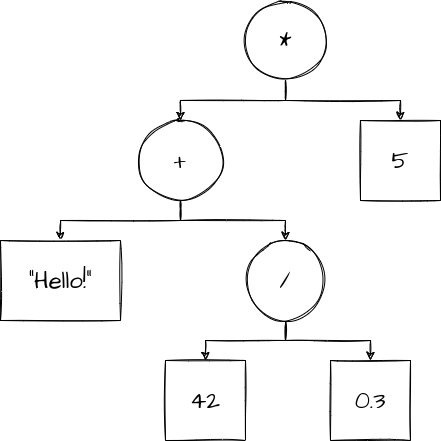
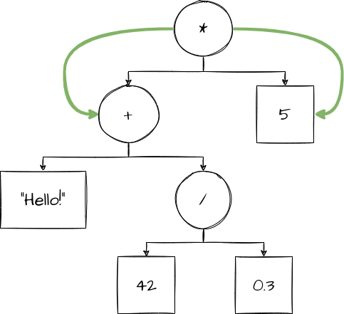
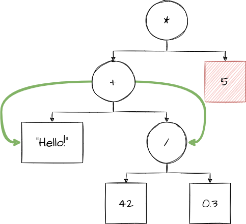
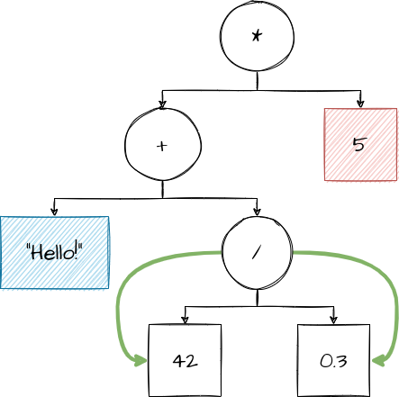
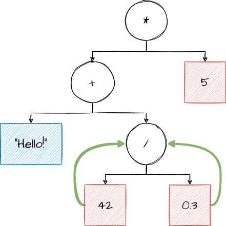
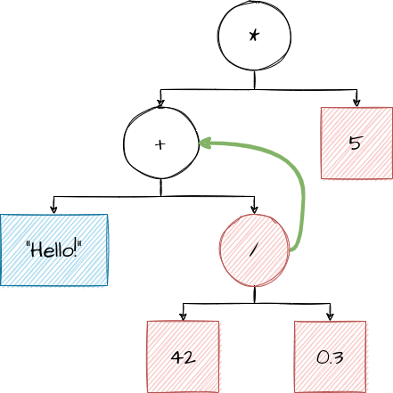
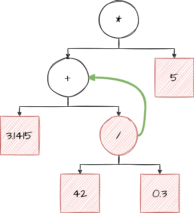
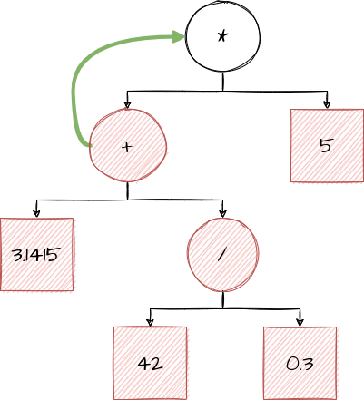
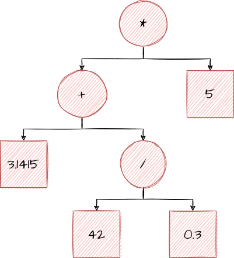

# Type Analysis: Analyzing and Understanding Programs

As was mentioned in the [High Level Overview](./02_high_level.html) section, after we've successfully parsed a program, we need to *analyze* it. We need to ensure that the program actually makes sense in context. 

## Background: What Is a "Type"?

Before we can explain what type-based analysis is and how we do it, we need to establish what a *type* even is. 

You've probably heard before that "computers only understand binary." This is technically correct: the only thing your computer actually operates on is big (as in  lists of 1s and 0s. But, in reality, those sets of 1s and 0s can mean vastly different things depending on the meaning that our *program* assigns to them. 

As an example, let's consider the following 64 0s and 1s (a 0 or a 1 will be called a "bit" from now on):

~~~
0100101001101111011010000110111000100000010001000110111101100101
~~~

I'd wager that this looks pretty meaningless to you, and you're completely right. There is no inherent meaning in these bits! There are quite literally trillions of valid ways we could interpret this data, depending on what *type* of data we pretend it contains. 

If we treat it as containing a single integer, we would get exactly `5,363,620,503,418,597,221`, or approximately 5.3 quintillion.

~~~
0100101001101111011010000110111000100000010001000110111101100101
^                                
5,363,620,503,418,597,221                  
~~~

We could also treat it as containing *two* integers, by making two 32 bit sections and treating each as individual integers. If we do that, we get `1,248,815,214` in the first 32 bits, and `541,355,877` in the second 32 bits.

~~~
01001010011011110110100001101110 00100000010001000110111101100101
^                                ^
1,248,815,214                    541,355,877
~~~

If we treat it as containing text, we could break it into 8 chunks of 8, and treat each chunk as a letter. When we do so, we get the text "`John Doe`":

~~~
01001010 01101111 01101000 01101110 00100000 01000100 01101111 01100101
^        ^        ^        ^        ^        ^        ^        ^
J        O        H        N        <space>  D        O        E
~~~

> *No, I am not making this up. That is actually the exact bit pattern that contains "`John Doe`" on your computer, at least in some programs. If you're interested (and aren't scared of extremely boring technical explanations), see [UTF-8 on Wikipedia](https://en.wikipedia.org/wiki/UTF-8).*

Point is, there are many different ways of interpreting these bits. The list above isn't exhaustive of course: when you make up the rules, you can say that those bits mean literally anything you want! Now, consider that your computer could be operating on quite literally *billions* of these at a time, and that the example shown is only 64 of them. It's just not reasonable for a human programmer to "just remember" what everything is! 

And that is where types come in. Types give us a way to categorize these bits, and say that "this section of bits represent text," or "this section of bits represents a 3D coordinate" or "these bits represent a fraction" or "these bits represent a single musical note." 

When we pair types with a programming language, they give us a way to *automate* all of this bit-hackery. Instead of thinking about programs as "these bits contain \<something\>", we can think of it as "we have a value of \<some type\>" that contains \<some value\>.  

## Type Checking

Now that we've established what a type is, how do we actually integrate this into a language? 

Recall back to the last section, where we discussed an "AST." We'll be using a very similar style of AST for this article, 
with one slight modification: we will have values that model text, they will be represented as a value `"With something inside quotes, like this"`.

Consider the following AST that models `("Hello!" + (42 / 0.3)) * 5`: 

Let's pretend for a moment that we just created this AST from parsing some imaginary language, and we aren't sure if it makes sense. In order to check if it does, we need to perform *type checking* it. 

### First Steps

When we type-check a program, we start at the "root" (top) of the AST. In this case it's a `*`.

> *Note: For the sake of correct terminology, I will be calling these "parts" of an AST a "node"*.

In type-checking, we are trying to verify if a program makes sense in context. A common way of doing this starts at the very top of the AST, and tries to verify of the root node. In order verify a node that has "children" (nodes connected with arrows in this case), both children have to be verified and have the type they evaluate to figured out.

> Note: We'll use a color-coding system to help represent the type of each node. Red is a node marked with the "number" type, blue nodes are marked with the "text" type. Green arrows just signify "we're looking at these nodes."

We start at the root node. In order to verify that the `*` is valid, we need to verify that both children are valid, **and** that both children evaluate to numbers.

We look at both children, like so: 

 

The node containing `5` is simple, we can see that `5` is a number. Therefore, that node is a number (as we expect), and we mark it as a number. The other node however is a `+`: we need to repeat the same steps as with `+`, because addition must operate on two numbers. 

Thus, we look at both children of the `+`:

 

We see that one child, `"Hello!"`, is quite obviously not a number. It's text data, and we mark it as text. The other node is a `/`, so we repeat the same steps as with `*` and `+`: check both children that they're numbers. 

`42` and `0.3` are both obviously numbers, so we can mark them as numbers. 

Now however, we have enough information to start figuring out our other nodes. We start going backwards now, starting with the `/` node. 

Both children are numbers, so we're fine in that regard. Since `42 / 0.3` evaluates to a number, we can mark the `/` operation itself as evaluating to a number. We then move backwards again to the `+` operator:

However, we have a problem this time! `+` adds two numbers, but one of our children isn't a number! 

We've just found a conflict with what we expect (`+` adding two numbers) and what the AST actually says to do (`+` adding some text and a number). Thus, the AST is not correct, and we have determined that the program does not make sense. 

This is precisely what type checking is supposed to find: places in the AST where the program does something that doesn't make sense. We've finished our job, and can stop now.

## A Correct Example

Let's change up the AST we've been working with slightly, and switch out the offending part of the AST with a number, to make it valid:

Now, when we look at the `+` node again, we have fulfilled our expectations: both children are numbers. Since adding two numbers yields a number, we mark the `+` as evaluating to a number, and go back up another layer. 

Just like `+` and `/`, both of our children are numbers, and multiplying two numbers yields a number so we mark it as a number. 

We've verified the root node! This time, we've type checked and found no issues in the AST. Our program is valid, and is ready to be used by the compiler later now that we know for certain that it is correct.

## Conclusion

Type-checking is an extremely important part of the compiler. Later parts of the compiler use the AST extensively, and more importantly, they rely on the assumption that the AST is completely correct. 

Type-checking both helps the programmer (as a failed type check can tell the programmer "Oh crap, I made a mistake"), and it helps the compiler. 

