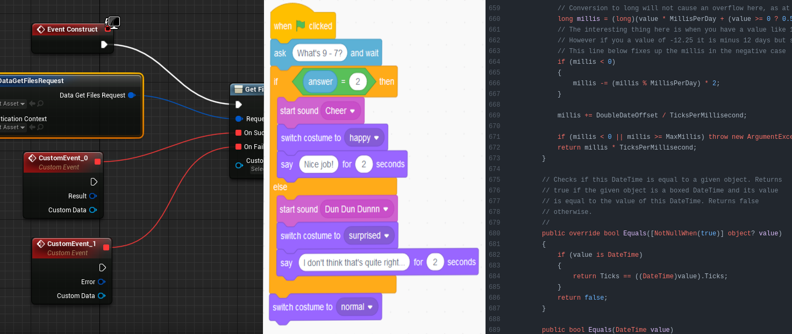

# Programming Languages Aren't Magic
When you write code, how do you write it? Probably by typing 
source code into an editor and hitting a "run" button, or by
running some commands in a terminal that make your code run. 

Maybe you've written some Java code like the following:

~~~ java
public static int multiply(int x, int y) {
  return x * y;
}
~~~

Or, maybe you learned Python and wrote something like this:

~~~ python
def multiply(x, y):
  return x * y
~~~

Whatever the case is, you were writing a glorified text file,
and *somehow*, the computer understood what it was and what to do with it.

But how?

## Computers Understand Instructions
Unfortunately, it's not as simple as "the computer understands what `x * y` means," because it actually doesn't! What your computer *actually* understands looks more akin to this:

~~~ nasm
137 248 15 175 198 195
~~~

Those numbers correspond to specific *machine instructions*, which are the operations that computers can actually perform. These are very low level, and must contain every precise detail of what needs to happen at the *machine* level. 

Examples:
  - "copy a value from one location to another"
  - "multiply the value at these 2 locations" 
  - "compare the values at these 2 locations"
  - "start executing the instructions at another location"
  - "update the value at this location to this new value"
  - "exchange the value at these 2 locations" 
  - "negate the value at this location and put the result at that location" 

To do anything remotely complicated, many of these instructions must be put together in a list that the computer can execute one-by-one. 
 
Depending on the computer, these instructions can be arbitrarily complicated or arbitrarily simple depending on the computer. Your desktop probably has an instruction to calculate sine/cosine for radians, while the computer chip inside a digital picture frame probably doesn't even have a multiply instruction. 

Humans used to actually have to write programs with these
machine instructions, and people realized fairly quickly
that this was too tedious and too error-prone to be sustainable
in the long term; thus, we began to try to find ways to avoid
writing these. 

What we needed was a way to describe what we wanted the computer to do, but in a way that both humans *and* computers could understand. 

## Two Approaches to the Same Problem
Two competing solutions to this problem arose.

1. Translate something that *humans* understand into something that the *computer* understands ahead-of-time
    - Think of it like a translator sitting down and transcribing a document into another language 

2. Make a program that can both understands something *humans* understand and knows how to *interpret* it for the computer, usually on-demand. 
    - Think of it like an interpreter listening to what you say and then repeating it in another language for someone else 

We call the former a *compiler* and the latter an *interpreter*. 

## Why Source Code?
Modern tools have mostly settled on one approach, taking a text file that contains text that happens to be formatted a certain way, and using that to produce a program. 

Text formats are not the only way of doing this, nor is there anything particularly special about text. Text just happens to be ubiquitous across every operating system, making it much simpler to share code between the variety of systems that used to exist. 

The same translation process described above happens in "visual" environments like Scratch or Unreal Engine's Blueprints, just in slightly different ways. 

They're all just methods of making the computer do what we want it to do, after all! 