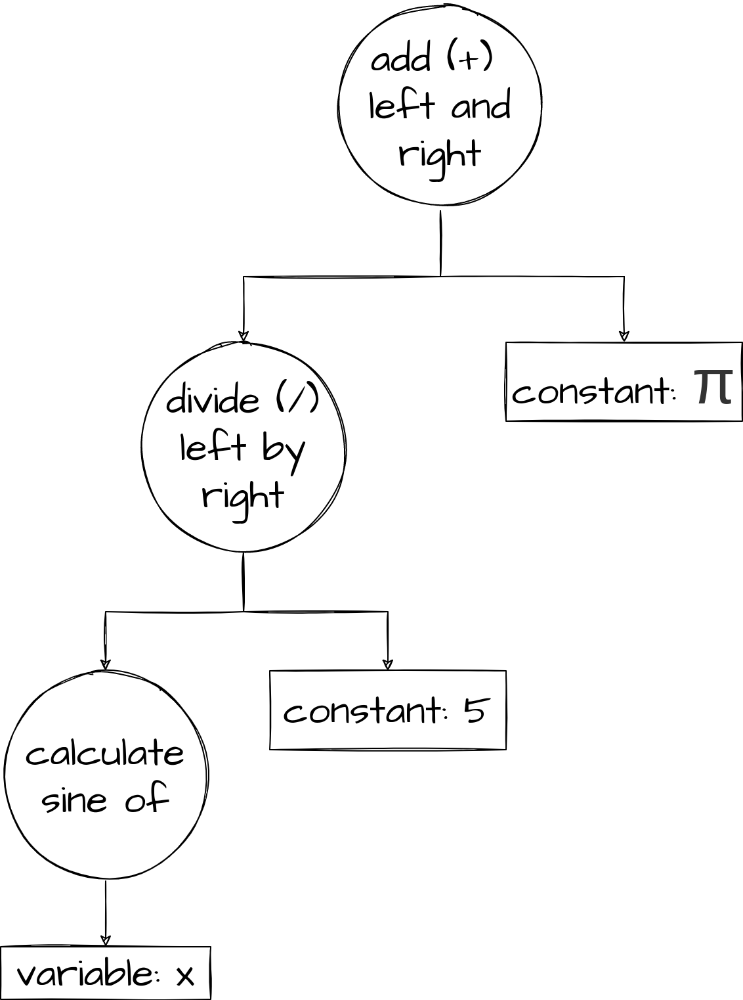

# Parsing: The Art of Understanding Text
If you just Google the definition of "parsing," you'll get this:

> analyze (a sentence) into its parts and describe their syntactic roles.
> 
> "I asked a couple of students to parse these sentences for me"

This is precisely what the first step of most compilers is. The compiler needs to *parse* a text file that a human gave it, and make sense of the code that the human wrote inside of that. 

But how does a compiler actually *do* that? 

## The Language
Consider an imaginary programming language that is written as a series of mathematical expressions and mathematical functions, and these are meant to tell the computer to evaluate some expression to a numeric value, or to graph some function. 

> We're going to ignore `xy` as shorthand for `x * y`, it makes the following explanation significantly more complicated and ends up impeding understanding. 

Let's also have some textual equivalents for common mathematical operations:
  - `sqrt(x)` -> $$ \sqrt{x} $$
  - `logN(x)` -> $$ \log_N{x} $$
  - `pi` -> $$ \pi $$ 
  - `x^N` -> $$ x^N $$

Here's some simple examples of what this imaginary language looks like: 

~~~
f(x) = x * sin(1 / x)

g(x) = sqrt(x^2) * log2(x)

8 * sin(pi / 6) + (12 - g(6)) / f(.3)
~~~

We as humans can look at this and understand what math it's trying to express. But, making a *compiler* understand this is significantly harder. 

## What The Computer Sees
Consider the following code for our imaginary programming language:

~~~
f(x) = 3 * x
~~~

When the compiler first looks at a file, it sees something very similar to this:

It doesn't have any immediate structure that it recognizes from the text file we gave it, all it sees is a really long list of characters, spaces, symbols and whatnot. 

This isn't unique to the above example either! Consider this example:

~~~
sin(x) / 5 + pi
~~~

No matter what we do, all the computer sees is a giant list of symbols! 

## "Lexing": Breaking Down The List
A huge list of single symbols is not exactly trivial to make sense of (although it *is* possible). Most compilers and other tools trying to make sense of a programming language start by "lexing" the list of symbols.

Lexing is shorthand for "lexical analysis": breaking down a big blob of text into logically related chunks. We call these chunks *tokens*. Often, lexing also "throws out" (ignores) symbols that are irrelevant to the actual meaning of a program. Things like spaces or tabs for example are completely irrelevant to the *meaning* of the math expressions shown above, and therefore lexing can safely ignore them. 

The goal of "lexing" is to turn a giant list of random symbols into something slightly more manageable. A smaller list of tokens is much easier to make sense of than a list of characters, after all. 

Consider again our second example.

~~~
sin(x) / 5 + pi
~~~

The end result of lexing would look something like this:

We may not have thrown out very much, but we have drastically simplified this for the computer. No longer does every other piece of code in the compiler have to know that `s` followed by `i` followed by `n` means `sin`, lexing has figured that out and now can just tell other code that there's a `sin` token. 

## Parsing
While lexing helped break apart the giant list of symbols into a more manageable list, parsing is what actually makes sense of that list. 

The goal of parsing is to turn the list of tokens into some structure the computer can understand. This typically means generating an "AST" (Abstract Syntax Tree). 

An AST is a highly abstract and highly structured representation of the code, and much more closely follows the *meaning* of the code rather than following what the text file says. 

Here's an example, an AST for the above list of tokens:

In this case, the AST is describing what operations the language is saying to do, and *in what order*. Things like order of operations need to be accounted for, the parser is supposed to be able to figure out that `1 + 2 * 3 / 4` is `1 + ((2 * 3) / 4)` and not `(1 + 2) * (3 / 4)` or whatever. 

To express this, the AST shows exactly how the equation should be evaluated. You start by looking at the "add," in order to evaluate this, you need to know what two numbers to add. So, you evaluate the left and the right. To evaluate the left, you need to evaluate both sides of the division before you divide, so you once again go down a level. 

It also needs to be able to understand commands in the language: in this case, it had to know that `sin` was referring to "take the sine of this value," and it had to actually figure out how to integrate that into the larger equation. 